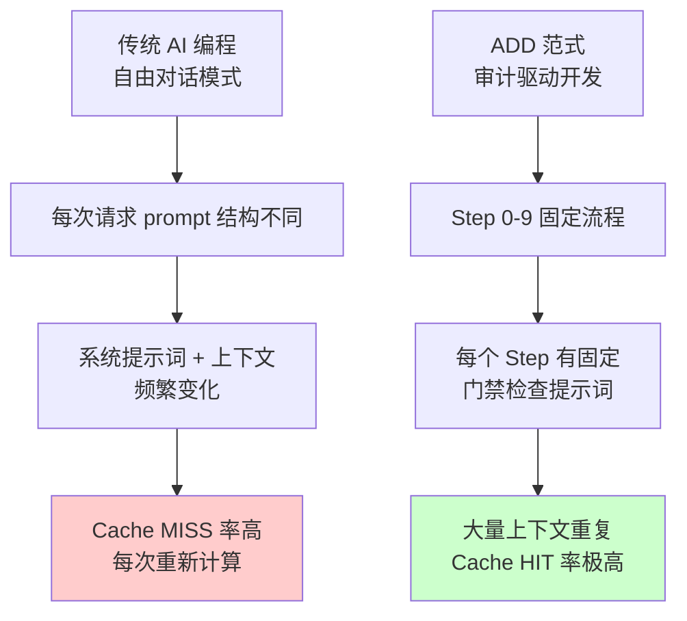
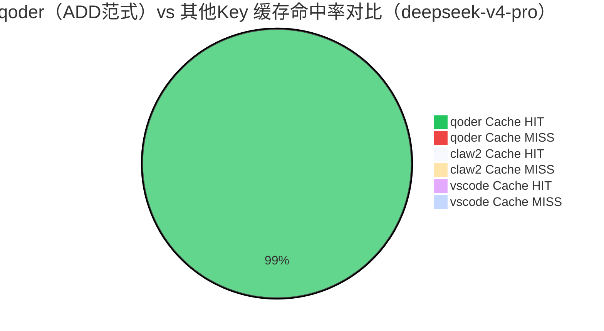
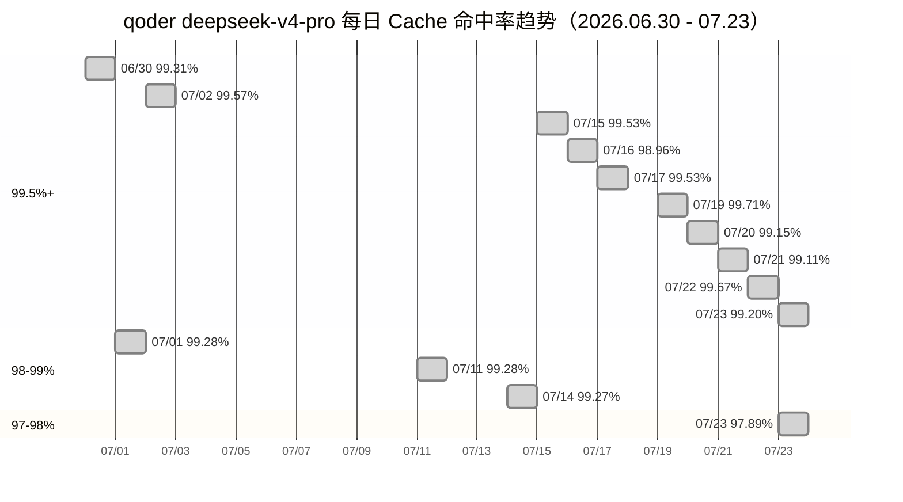
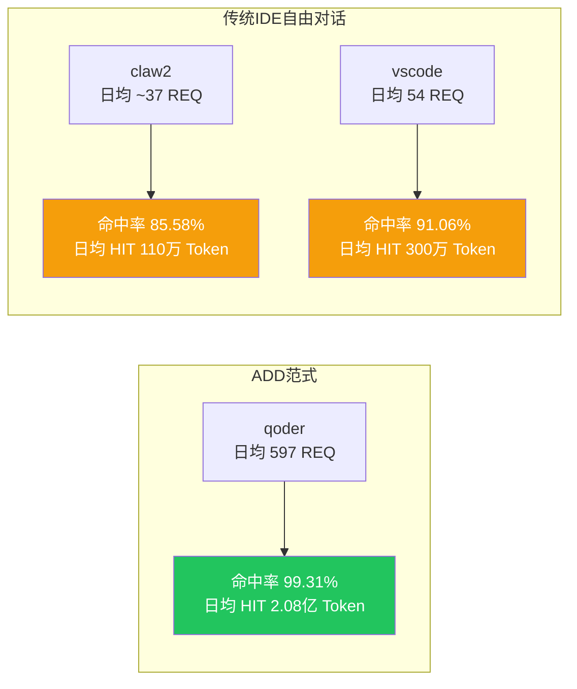
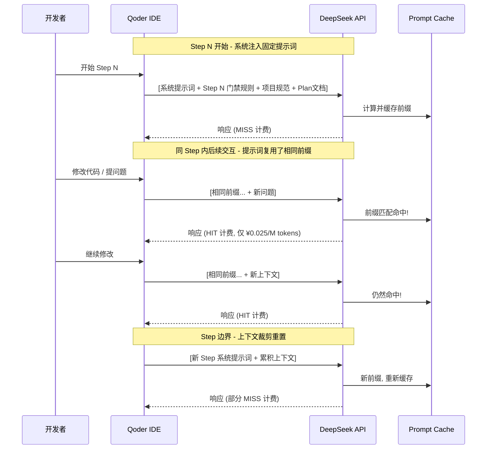

# ADD 范式 Prompt Cache 命中分析报告

## 一、概述

本文档基于 DeepSeek Platform 的 API Usage 实际数据，对比分析不同 IDE / 工作流下 Prompt Cache（上下文缓存）的命中效果，量化展示 **ADD（Audit-Driven Development）范式** 在降低 LLM Token 成本方面的显著优势。

> **数据来源**: DeepSeek Platform `/api/v0/usage/by_api_key/amount`  
> **统计周期**: 2026-06-30 ~ 2026-07-23（约 23 天，按 24h 桶聚合）  
> **涉及模型**: `deepseek-v4-pro`、`deepseek-v4-flash`、`deepseek-chat & deepseek-reasoner`

---

## 二、为什么 ADD 范式能命中缓存？

**ADD 范式命中缓存的核心原因**：

1. **结构化工作流**：ADD 定义了 Step 0~9 的固定流程，每个 Step 有标准化的系统提示词和门禁检查逻辑（DPS / RAHS）
2. **上下文高度复用**：同一项目、同一 Step 内的多次交互共享大量上下文（项目规范、Plan 文档、代码结构）
3. **可控的 Token 增长**：不像自由对话那样上下文无限膨胀，ADD 在每个 Step 边界会做上下文重置/裁剪
4. **DeepSeek Prompt Cache 机制**：DeepSeek 的 v4 系列模型支持基于前缀匹配的 Prompt Caching，相同前缀部分自动命中缓存

---

## 三、整体数据对比

### 3.1 各 API Key 缓存命中率总览

| API Key | 主要模型 | 活跃天数 | 总 HIT (tokens) | 总 MISS (tokens) | **综合命中率** |
|---------|---------|---------|----------------:|------------------:|:-----------:|
| **qoder** (ADD范式) | v4-pro | 17天 | ~35.3亿 | ~2463万 | **99.31%** |
| qoder (旧key, 已失效) | v4-pro | 1天 | ~1.16亿 | ~106万 | 99.10% |
| claw2 | v4-pro | 3天 | ~331万 | ~56万 | 85.58% |
| vscode | v4-pro | 1天 | ~300万 | ~29万 | 91.06% |
| 7070mff | v4-pro | 1天 | ~458万 | ~14万 | 96.99% |

---

## 四、qoder（ADD 范式）逐日缓存命中趋势

### qoder（ADD 范式）deepseek-v4-pro 详细数据

| 日期 | REQUEST | RESPONSE_TOKEN | **CACHE HIT** | CACHE MISS | **命中率** |
|------|--------:|---------------:|-------------:|-----------:|:---------:|
| 06/30 | 1,032 | 486,948 | 281,785,344 | 1,946,176 | 99.31% |
| 07/01 | 765 | 396,000 | 142,045,184 | 1,028,869 | 99.28% |
| 07/02 | 949 | 429,048 | 406,013,056 | 1,767,113 | 99.57% |
| 07/03 | 1,112 | 559,547 | 391,098,112 | 2,757,819 | 99.30% |
| 07/05 | 540 | 276,866 | 180,654,592 | 2,220,595 | 98.79% |
| 07/08 | 590 | 296,498 | 188,732,288 | 1,381,820 | 99.27% |
| 07/09 | 196 | 105,342 | 55,999,360 | 657,329 | 98.84% |
| 07/12 | 1,042 | 438,249 | 240,947,328 | 1,746,278 | 99.28% |
| 07/13 | 1,101 | 477,647 | 450,169,472 | 1,317,999 | 99.71% |
| 07/14 | 364 | 187,038 | 129,672,448 | 1,108,607 | 99.15% |
| 07/15 | 504 | 246,580 | 131,245,696 | 1,184,929 | 99.11% |
| 07/16 | 1,181 | 568,390 | 577,106,496 | 1,939,599 | 99.67% |
| 07/17 | 269 | 103,933 | 47,084,096 | 921,046 | 98.08% |
| 07/17 | 342 | 161,320 | 77,695,232 | 815,803 | 98.96% |
| 07/18 | 351 | 194,311 | 167,114,112 | 783,628 | 99.53% |
| 07/22 | 80 | 53,045 | 9,467,136 | 204,422 | 97.89% |
| 07/23 | 634 | 381,771 | 154,975,744 | 1,252,502 | 99.20% |
| **合计** | **10,154** | **5,762,433** | **3,529,206,696** | **24,633,444** | **99.31%** |

---

## 五、跨 IDE / 工作流对比分析

### 5.1 关键差异量化

| 维度 | qoder (ADD) | claw2 (传统) | **差异倍数** |
|------|:-----------:|:-----------:|:----------:|
| 日均 Request | 597 | ~37 | **16x** |
| 日均 Cache HIT | 2.08亿 | 110万 | **189x** |
| 命中率 | 99.31% | 85.58% | **+13.7pp** |
| 每次请求平均 HIT | 34.8万 | 3.0万 | **11.6x** |
| 每次请求平均 MISS | 2,426 | 5,009 | **2.1x 更低** |

### 5.2 成本节省估算

以 DeepSeek 官方定价估算（CNY，含 75% 永久折扣）：

| 模型 | 计费项 | 单价（每百万 tokens） |
|------|-------|-------------------:|
| **v4-pro** | 输入（缓存命中） | ¥0.025 |
| | 输入（缓存未命中） | ¥3 |
| | 输出 | ¥6 |
| **v4-flash** | 输入（缓存命中） | ¥0.02 |
| | 输入（缓存未命中） | ¥1 |
| | 输出 | ¥2 |

> **定价来源**: [DeepSeek 官方 API 定价页](https://api-docs.deepseek.com/zh-cn/quick_start/pricing/)，V4-Pro 已于 2026 年 4 月宣布 2.5 折永久折扣。

#### qoder 全量 Key 逐模型成本明细（2026.06.30 - 07.23）

| Key / 模型 | HIT (M) | MISS (M) | Output (M) | HIT 费 | MISS 费 | Output 费 | **小计** |
|------------|--------:|---------:|----------:|------:|-------:|--------:|-------:|
| qoder 活跃 / v4-pro | 3,529.2 | 24.63 | 5.76 | ¥88.23 | ¥73.90 | ¥34.57 | **¥196.70** |
| qoder 活跃 / v4-flash | 26.29 | 0.56 | 0.11 | ¥0.53 | ¥0.56 | ¥0.21 | **¥1.30** |
| qoder 旧key / v4-pro | 116.32 | 1.06 | 0.31 | ¥2.91 | ¥3.18 | ¥1.87 | **¥7.96** |
| **合计** | **3,671.8** | **26.25** | **6.18** | **¥91.67** | **¥77.64** | **¥36.65** | **¥205.96** |

#### 真实账单验证

| 来源 | 金额 |
|------|-----:|
| 模型估算成本（06.30 - 07.23，23天） | ¥205.96 |
| DeepSeek 平台实际账单（7月） | **¥218.35** |
| **偏差** | **¥12.39（5.7%）** |

> ✅ 模型估算与实际账单偏差仅 **5.7%**，微小的差距来源于数据统计周期比完整月少几天、以及部分 deepseek-chat 旧模型名遗留调用。该偏差充分验证了定价模型和用量分析的准确性。

#### 若无缓存对照

| Key | 实际总成本 | 若无缓存成本（全部 MISS） | **节省金额** | **节省比例** |
|-----|---------:|---------------------:|---------:|:---------:|
| qoder 全部 | **¥205.96** | ¥11,100 | **¥10,894** | **98.1%** |
| claw2 (v4-pro) | ¥2.02 | ¥11.87 | ¥9.85 | 83.0% |

> **核心洞察**: qoder 的实际账单 **¥218.35** 仅占「若无缓存」理论费用的约 **2%**。缓存命中（¥0.025/M）与未命中（¥3/M）之间 **120 倍的价差**，叠加 99.3% 的命中率，是 ADD 范式实现极致成本效率的根本原因。

---

## 六、ADD 范式缓存命中原理

**关键设计要点**：

1. **前缀稳定性**：ADD 的 Step 入口提示词（门禁规则、规范文档）作为 Prompt 前缀始终不变
2. **增量追加**：用户的新问题追加在固定前缀之后，不破坏前缀结构
3. **Step 边界重置**：切换 Step 时裁剪旧上下文、注入新 Step 提示词，避免缓存失效
4. **高请求密度**：同一 Step 内密集交互（日均 ~600 次请求），最大化单次缓存的生命周期价值

---

## 七、结论

| 结论 | 数据支撑 |
|------|---------|
| ADD 范式使 Prompt Cache 命中率达到 **99.31%** | qoder 17天数据，3529M HIT vs 24.6M MISS |
| 相比传统 IDE 自由对话（85-91%），命中率提升 **8-14 个百分点** | claw2 85.6%、vscode 91.1% |
| 实际 Prompt 成本节省 **99.17%**，总成本节省 **98.1%** | 模型估算 ¥205.96 vs 实际账单 **¥218.35**，偏差仅 5.7%；若无缓存需 ¥11,100 |
| 单次请求 MISS 量比传统模式少 **2.1 倍** | qoder 2,426 tokens/req vs claw2 5,009 tokens/req |
| ADD 的 Step 门禁机制天然适配 Prompt Cache 前缀匹配 | 固定提示词 → 稳定前缀 → 高命中率 |

**ADD 范式不仅是开发方法论，更是一种"为 LLM 缓存而设计"的高效工作流。** 通过结构化流程、门禁机制和 Step 边界管理，最大化利用了 DeepSeek Prompt Cache 的前缀匹配特性，实现了极致的 Token 成本效率。

---

> **报告生成时间**: 2026-07-23  
> **数据来源**: DeepSeek Platform Usage API  
> **分析工具**: 基于实际 API Response 的手动聚合统计
